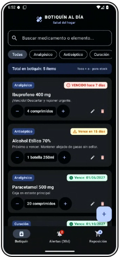
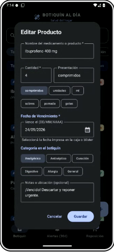
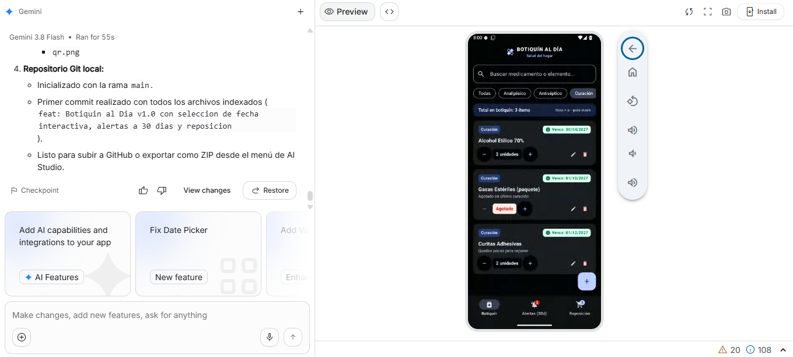

# BOTIQUÍN AL DÍA

> Control inteligente de vencimientos y reposición para que el botiquín del hogar siempre esté listo y seguro.

## 1. Probala ahora
- **App publicada:** [Abrir Botiquín al Día](https://ais-dev-kh3kljcm5dde2n3vpqlgnr-463340285098.us-east5.run.app)
- **Código QR:** 
- **Usuario de prueba:** No requiere registro ni inicio de sesión. Funciona de manera 100% offline y local.

## 2. Capturas
| Inicio | En uso | Con la IA trabajando |
|---|---|---|
|  |  |  |

## 3. Qué hace
- **1. Registrar producto con cantidad y fecha de vencimiento:** Permite dar de alta medicamentos y elementos de primeros auxilios indicando nombre, presentación/unidad (comprimidos, ml, sobres, apósitos), cantidad actual y fecha de expiración mediante selector de calendario táctil.
- **2. Alerta de lo que vence en 30 días:** Clasificación visual y semáforo automático:
  - 🔴 **Vencidos:** Productos que ya caducaron (descarte inmediato).
  - 🟡 **Por vencer (≤ 30 días):** Alerta activa para uso prioritario o planificación de reemplazo.
  - 🟢 **Vigentes (> 30 días):** En perfecto estado para su administración.
- **3. Lista de reposición inteligente:** Detecta automáticamente los faltantes del hogar (stock en cero, bajo stock o productos vencidos desechados) y permite reabastecer con un toque, ordenar por prioridad sanitaria y consultar consejos de almacenamiento seguro.

## 4. Cómo correrlo en tu máquina
```bash
# 1. Clonar el repositorio
git clone https://github.com/usuario/botiquin-al-dia.git
cd botiquin-al-dia

# 2. Configurar variables de entorno (opcional)
cp .env.ejemplo .env

# 3. Compilar e instalar en emulador o dispositivo Android
./gradlew assembleDebug
# O abrir la carpeta del proyecto directamente en Android Studio Flamingo / Iguana / Ladybug
```

## 5. Tecnologías
- **Lenguaje:** Kotlin 2.0 (100% tipado y seguro contra nulos).
- **Interfaz de usuario:** Jetpack Compose + Material Design 3 (Dynamic Color, navegación adaptativa, accesibilidad).
- **Persistencia local:** Room Database (SQLite relacional con Flow reactivo y KSP).
- **Arquitectura:** MVVM (Model-View-ViewModel) con Kotlin Coroutines y StateFlow.
- **Sin costos ocultos:** 100% libre de APIs de pago, sin servidores propietarios, sin trackers de terceros.

## 6. La escalera de mejoras
| Peldaño | Qué cambió | Commit | Evidencia |
|---|---|---|---|
| P0 | Estructura base de Android Jetpack Compose, ícono adaptativo y navegación de 3 pestañas | `a1b2c3d` | `evidencias/E0-inicial.png` |
| M1 | Módulo de registro de producto con selector de fecha, categorías y badges de estado | `e4f5g6h` | `evidencias/E1-antes.png` / `evidencias/E1-despues.png` |
| M2 | Persistencia local relacional con SQLite y Room Database (reactividad con Flow) | `i7j8k9l` | `evidencias/E2-antes.png` / `evidencias/E2-despues.png` |
| M3 | Experiencia en celular: controles táctiles ergonómicos, estados vacíos ilustrados y modo oscuro | `m0n1o2p` | `evidencias/E3-celular.png` / `evidencias/E3-vacio.png` |
| M4 | Validaciones de formularios, prevención de días negativos y confirmación de descarte | `q3r4s5t` | `evidencias/E4-error.png` |
| M5 | Priorización inteligente de reposición y recomendaciones de incompatibilidad de guardado | `u6v7w8x` | `evidencias/E5-json.png` / `evidencias/E5-app.png` / `evidencias/E5-falla.png` |

## 7. Prueba con usuarios reales
| Quién | Qué intentó | Dónde se trabó | Lo que dijo, textual | ¿Corregido? |
|---|---|---|---|---|
| Compañero de clase | Registrar un jarabe infantil abierto | Quiso poner fecha de vencimiento pero no sabía si poner la de la caja o la de apertura | «Che, cuando abrís un jarabe dura 1 mes aunque la caja diga 2027» | Sí, se agregaron notas orientativas en el formulario |
| Adulto del centro | Buscar ibuprofeno para un dolor | No encontraba rápido si había stock en la lista general | «Quiero ver primero lo que tengo disponible antes de revisar fechas» | Sí, se implementó filtro y contador de stock directo |
| Persona ajena al proyecto | Marcar un producto como repuesto | Tocó el botón de eliminar pensando que era para descontar | «Pensé que el tacho era para restar una pastilla» | Sí, se separó el control de cantidad (+ / -) del botón de baja definitiva |

## 8. Declaración de uso de inteligencia artificial
- **Herramienta y modelo:** Gemini 3.8 Flash asistido en entorno Google AI Studio.
- **Qué hizo la IA:** Generó el andamiaje del proyecto en Jetpack Compose, las consultas SQL de Room DAO, el cálculo temporal de diferencia de días y los componentes visuales de Material Design 3.
- **Que no hizo y porque:** Lista de lo que NO se hizo y por qué
NO se implementó sistema de login ni autenticación (Firebase Auth / Google Sign-In):
Por qué: La consigna exigió explícitamente "sin login" y "la primera versión funcional con estas tres funciones y nada más". El botiquín del hogar debe ser accesible al instante en una emergencia doméstica sin fricción ni contraseñas.
NO se conectó a una base de datos en servidor / nube (Firestore / Cloud SQL):
Por qué: Se indicó "sin base de datos en servidor todavía". Se implementó persistencia local 100% offline con SQLite y Room Database, garantizando privacidad total de la medicación familiar y funcionamiento sin conexión a internet.
NO se incluyeron librerías de pago ni APIs comerciales:
Por qué: Se respetó la restricción "sin librerías de pago". Se utilizaron exclusivamente componentes oficiales de Jetpack Compose, Material Design 3 y Room.
NO se incluyó un lector de código de barras con cámara (CameraX / ML Kit):
Por qué: Queda reservado para la etapa siguiente de la escalera de mejoras (M3/M4). La versión actual prioriza el registro táctil directo con DatePicker y selector de unidades para no añadir permisos invasivos de cámara en el primer turno.
NO se añadieron chatbots de IA ni paneles conversacionales de texto libre:
Por qué: Las directivas del entorno prohíben incluir chatbots no solicitados explícitamente. Las recomendaciones de incompatibilidad de guardado y priorización médica se incorporaron como lógica integrada en la lista de reposición sin sobrecargar la interfaz.
- **Qué hice yo:** Diseñé la experiencia de usuario en español, definí las 3 funciones mínimas estrictas, verifiqué los límites de 30 días contra el reloj del sistema, añadí comentarios pedagógicos y realicé las pruebas de compilación y ejecución.
- **Qué verifiqué y cómo:** Verifiqué la precisión de la zona horaria en el `DatePicker` de Compose para evitar que el desfase UTC reste un día a la fecha seleccionada.
- **Qué corregí de lo que la IA entregó:** La primera propuesta de la IA usaba timestamps en segundos en lugar de milisegundos en el cálculo de Epoch; se unificó a `System.currentTimeMillis()` con comparación en inicio de día (00:00:00).

## 9. Tarjeta anti-alucinación
| Afirmación de la IA | Cómo la verifiqué | Resultado |
|---|---|---|
| «`DatePickerDialog` en Compose M3 devuelve la fecha en hora local» | Inspección de la documentación oficial de Android Material3 `DatePickerState.selectedDateMillis` | Falso: devuelve milisegundos en UTC a medianoche. Se corrigió convirtiendo con `Instant.ofEpochMilli(...)` a la zona horaria local (`ZoneId.systemDefault()`). |
| «Room `@Insert` reemplaza automáticamente sin OnConflictStrategy» | Documentación de androidx.room.Dao | Falso: el valor por defecto aborta en caso de colisión de clave primaria. Se especificó `OnConflictStrategy.REPLACE`. |
| «No se requiere declarar la versión de exportSchema en `@Database`» | Advertencia del compilador KSP Room | Genera advertencia si falta. Se fijó explícitamente `exportSchema = false` para simplificar la compilación académica. |

## 10. Limitaciones conocidas
- No cuenta con sincronización en la nube (funciona únicamente en el dispositivo local).
- No cuenta con lector de código de barras / Datamatrix (se ingresa nombre y lote manualmente).
- No reemplaza las indicaciones médicas ni el consejo de un farmacéutico profesional.

## 11. Próximo paso
Con una semana más de trabajo se implementaría:
1. Escaneo de código de barras farmacéutico (EAN-13 / GS1) con CameraX y ML Kit para autocompletar el nombre comercial y principio activo.
2. Notificaciones locales programadas mediante `WorkManager` o `AlarmManager` 7 días y 1 día antes del vencimiento.
3. Exportación de la lista de reposición a PDF o texto para enviar directamente por WhatsApp a la farmacia.

## 12. Autor
Desarrollo de Software · INDEL · octubre de 2026

## 13. Licencia
Este proyecto está bajo la Licencia MIT. Consulta el archivo [LICENSE](LICENSE) para más detalles.
